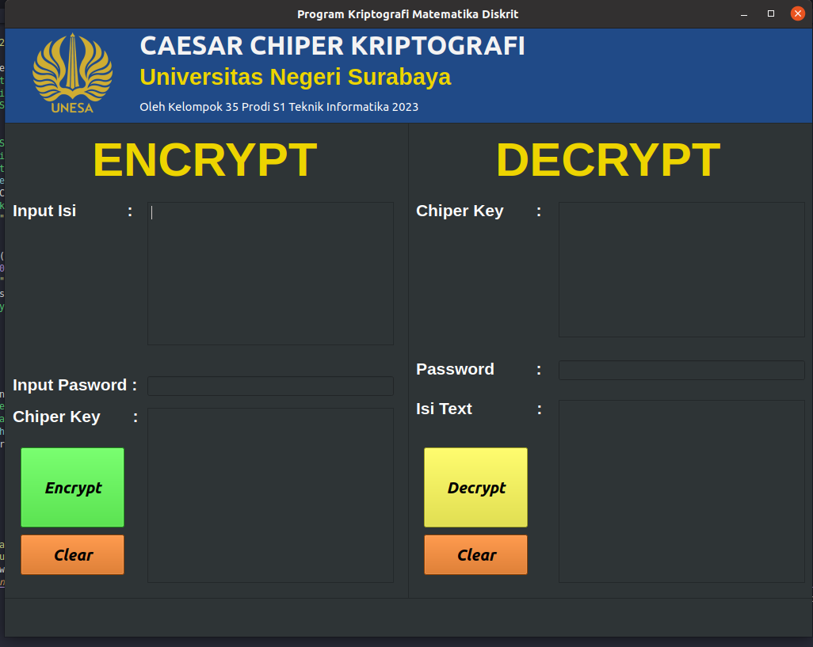

## Output Program

This program for encrypt and decrypt code with caesar chiper alghoritm

## ⚡ How to run

Install library PyQt5 in your device copy this promp in terminal

```md
pip install pyqt5
```

if you use windows run this prompt:

```md
python main.py
```

if you use linux-ubuntu run this prompt:
```md
python3 main.py
```


## Output Program


